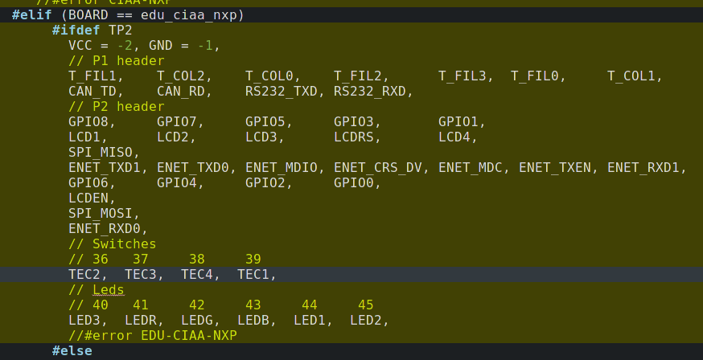

El ejercicio adicional consistía en hacer un "desplazamiento" en las definciones del mapeo de los LEDs y de los botones en el archivo sapi_peripheral_map.h. En la imagen se muestra como se realizó esto para desplazar todos los LEDs en una a la derecha y los botones uno a la izquierda.

Observar que se utilizó compilación condicional para que, cuando se define TP2, se haga ese desplazamiento de los puertos.
