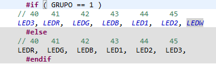

a)
Para compilación condicional se utilizan macros de la siguiente forma:
```
#ifdef X_MACRO
...
#endif
```
También se admiten estructuras de este tipo:

```
#if X_MACRO == X_VALOR
...
#endif
```

De este modo se va a compilar solo el código encerrado por ese #ifdef si se define anteriormente X_MACRO.


Ejemplo:



b) A continuación se presenta una tabla de las funciones usadas en tickHook.c.
|Función|Descripción de lo que hace|
|:------------------------------------------------------------|:---------------------------------------------|
|void myTickHook( void *ptr )|Función ejecutada cada vez que se produce un tick, está definida dentro de tickHook.c. Ptr son los parámetros pasados (en este caso que LED enciende).|
